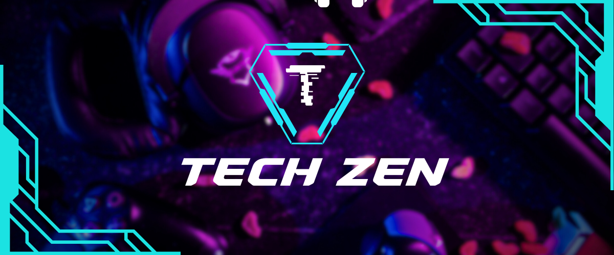

Here’s a well-crafted **About** section for your blog website and a beautiful **README** for your GitHub project, **Tech-Zen**.

---

### About Tech-Zen

**Tech-Zen** is a modern, user-friendly blog platform designed for tech enthusiasts, developers, and curious minds. Whether you're a seasoned programmer, a tech newbie, or someone who loves exploring the latest trends in technology, Tech-Zen is your go-to destination for insightful articles, tutorials, and industry updates.

Our mission is to create a space where technology meets simplicity. We believe in breaking down complex concepts into digestible content, making tech accessible to everyone. From coding tutorials and software development tips to the latest in AI, cybersecurity, and gadget reviews, Tech-Zen covers it all.

Join our community, share your knowledge, and stay updated with the ever-evolving world of technology. Let’s embrace the future, one blog post at a time.

---

### README for Tech-Zen

# Tech-Zen 🌐  
**A Modern Blog Platform for Tech Enthusiasts**

  


---

## 📖 About  
**Tech-Zen** is a blog website designed to provide high-quality, engaging, and informative content about technology. It’s built for developers, tech lovers, and anyone curious about the digital world. The platform features articles, tutorials, and news on topics like programming, AI, cybersecurity, gadgets, and more.

---

## ✨ Features  
- **Responsive Design**: Works seamlessly on all devices.  
- **User-Friendly Interface**: Easy navigation and clean layout.  
- **Categories**: Organized content for better exploration.  
- **Search Functionality**: Find articles quickly.  
- **Markdown Support**: Write and format posts effortlessly.  
- **Dark Mode**: Eye-friendly reading experience.  

---

## 🛠️ Technologies Used  
- **Frontend**: HTML, CSS, JavaScript, React.js  
- **Backend**: Node.js, Express.js  
- **Database**: MongoDB  
- **Authentication**: JWT (JSON Web Tokens)  
- **Deployment**: Netlify (Frontend), Heroku (Backend)  

---

## 🚀 Getting Started  

### Prerequisites  
- Node.js installed  
- MongoDB Atlas account or local MongoDB setup  
- Git installed  

### Installation  
1. **Clone the Repository**  
   ```bash
   git clone https://github.com/arifbasha559/Tech-zen.git
   cd Tech-zen
   ```

2. **Install Dependencies**  
   ```bash
   npm install
   ```

3. **Set Up Environment Variables**  
   Create a `.env` file in the root directory and add the following:  
   ```env
   MONGO_URI=your_mongodb_connection_string
   JWT_SECRET=your_jwt_secret_key
   PORT=5000
   ```

4. **Run the Application**  
   ```bash
   npm start
   ```

5. **Open the App**  
   Visit `http://localhost:3000` in your browser.  

---

## 📂 Project Structure  
```plaintext
Tech-zen/  
├── client/            # Frontend code (React.js)  
├── server/            # Backend code (Node.js, Express.js)  
├── models/            # Database models  
├── routes/            # API routes  
├── controllers/       # Logic for handling requests  
├── middleware/        # Custom middleware (e.g., authentication)  
├── .env               # Environment variables  
├── .gitignore         # Files to ignore in Git  
├── package.json       # Project dependencies  
└── README.md          # Project documentation  
```

---

## 🤝 Contributing  
We welcome contributions! If you'd like to contribute to Tech-Zen, please follow these steps:  
1. Fork the repository.  
2. Create a new branch (`git checkout -b feature/YourFeatureName`).  
3. Commit your changes (`git commit -m 'Add some feature'`).  
4. Push to the branch (`git push origin feature/YourFeatureName`).  
5. Open a pull request.  

---

## 📄 License  
This project is licensed under the MIT License. See the [LICENSE](LICENSE) file for details.  

---

## 🙏 Acknowledgments  
- Inspired by the tech community.  
- Built with love and passion for technology.  

---

## 🌐 Live Demo  
Check out the live demo of Tech-Zen: [https://tech-zen.netlify.app](https://tech-zen.netlify.app)  
*(Replace with your actual deployment link)*  

---

## 📧 Contact  
Have questions or suggestions? Feel free to reach out:  
- **Email**: arifbasha559@example.com  
- **GitHub**: [arifbasha559](https://github.com/arifbasha559)  
- **LinkedIn**: [Your LinkedIn Profile](https://linkedin.com/in/yourprofile)  

---

Let’s build the future of tech blogging together! 🚀  

---

This README is clean, professional, and visually appealing. You can customize it further with your own details, images, and links. Good luck with your project! 😊